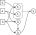
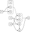

# FunctionFlow.jl 

*Automatic lazy dependency resolution for computational DAGs in Julia.*

## Installation
Install `FunctionFlow.jl` from the Julia REPL

```julia
add ] https://github.com/nicomignoni/FunctionFlow.jl.git
```

## Quickstart

### Constructing a simple computational DAG
Suppose you wrote a mathematical model characterized by the following functions
```@example QUICKSTART
f(a) = 2a + 3
g(a, b) = b^2 - a
h(g, b) = g + 4b
k(f, h) = h * (f - 1)
```
Some function arguments are themselves functions; this dependency can be expressed through a directed acyclic graph (DAG) as follows

```@raw html

```

In order to calculate `k`, you need to compute `f`, `g`, and `h` first, which can be tedious and error-prone when the computational DAG grows. Since all these functions can be eventually expressed with respect to `a` and `b`, it would be more convenient to be able to write `f(a, b)` (or `h(a, b)`, for instance). 

`FunctionFlow.jl` does exactly this: it allows you to write a function as a `Node` of a computational DAG, which can be in turn evaluated as a function of the `base` arguments only.

```@example QUICKSTART
using FunctionFlow

f_node = Node(f, :a)
g_node = Node(g, :a, :b)
h_node = Node(h, g_node, :b)
k_node = Node(k, f_node, h_node)

nothing # hide
```

A `Node` is constructed by passing the function it represents, and the "arguments", either `Symbols` or other `Nodes`. The `base` of a `Node` is the sequence of root arguments that do not depend on any other node

```@repl QUICKSTART
base(k_node)
```

We can now pass `a` and `b` as keyword arguments to `k_node` to compute `k` without explicitly evaluating `h`, `g`, and `f` beforehand 

```@repl QUICKSTART 
k_node(a = 3, b = 2)
```

By recursively substituting `h`, `g`, and `f` in `k`, we can rewrite it as explicitly dependent on `a` and `b`

```@example QUICKSTART
k_explicit(a, b) = k(f(a), h(g(a, b), b))

nothing # hide
```

and then check that it would produce the same result

```@repl QUICKSTART
k_explicit(3, 2) == k_node(a = 3, b = 2)
```

### Disambiguating DAG nodes

Sometimes, a certain quantity can be calculated through different functions. In our example, let's suppose that the quantity returned by `f` can be calculated through functions `f1` or `f2`, defined, respectively, as follows 

```@example QUICKSTART
f1(a) = 2a + 3
f2(b, d) = 2.3d + b

nothing # hide
```

The computational DAG becomes as follows

```@raw html

```

Let's create a `Node` for each of them

```@example QUICKSTART
f1_node = Node(f1, :a)
f2_node = Node(f2, :b, :d)

nothing # hide
```

If we are not sure which one we want to use when building the DAG, we can create and *ambiguous* node, which stores both `Node` options 

```@example QUICKSTART
k_node = Node(k, Ambiguity(f1_node, f2_node), h_node)

nothing # hide
```

Now, if we want to resolve the DAG using the `f2_node`, we do

```@repl QUICKSTART
k_node(f2_node; a = 3, b = 2, d = 4)
```

Note that `f1` is equivalent to `f`, so we can check that 

```@repl QUICKSTART
k_node(f1_node; a = 3, b = 2) == k_node(a = 3, b = 2)
```
where we don't need `d` since we are not computing `f2`. The base for an ambiguous `Node` can be defined only when the `Ambiguities` are defined: for our example, we have

```@repl QUICKSTART
base(k_node, f1_node)
```

`Ambiguity` can take a default `Node` as well: suppose we want the DAG to resolve by default through `f2`; we can write

```@example QUICKSTART
k_node = Node(k, Ambiguity(f1_node, f2_node; default=f2_node), h_node)

nothing # hide
```

so we don't need to specify the `Node` to resolve through

```@repl QUICKSTART
k_node(a = 3, b = 2, d = 4)
```


Let us consider a larger DAG
```@raw html

```

and write the updated model and computational graph and `Nodes` 

```@example QUICKSTART
# Model
g(a, b) = b^2 - a
h(g, b) = g + 4b

m1(e) = log(1 + e)
m2(e) = sin(e)

f1(a) = 2a + 3
f2(b, m) = 2.3m + b

k(f, h) = h * (f - 1)

# DAG
g_node = Node(g, :a, :b)
h_node = Node(h, g_node, :b)

m1_node = Node(m1, :d)
m2_node = Node(m2, :d, :e)

f1_node = Node(f1, :a)
f2_node = Node(f2, :b, Ambiguity(m1_node, m2_node, :d))

k_node = Node(k, Ambiguity(f1_node, f2_node; default=f2_node), h_node)

nothing # hide
```

```@repl QUICKSTART
k_node(m1_node, f2_node; a = 3, b = 2, d = 4)
```

As we did before, we can write the explicit expression for `k`, by recursively substituting the functions comprising it

```@example QUICKSTART
k_explicit(a, b, d) = k(f2(b, m1(d)), h(g(a, b), b))

nothing # hide
```

and check that it produces the same result

```@repl QUICKSTART
k_explicit(3, 2, 4) == k_node(m1_node, f2_node; a = 3, b = 2, d = 4)
```

### Caching

Each `Node` caches its value, based on the hashed `(base, selection)`, in a [Least-Recently-Used cache](https://en.wikipedia.org/wiki/Cache_replacement_policies#Least_Recently_Used_(LRU)) provided by [`LRUCache.jl`](https://github.com/JuliaCollections/LRUCache.jl).

```@example QUICKSTART
using LRUCache

cache_info(k_node.cache)
```

Default cache size is `1`, but it can be incremented by passing `cache_size` to the `Node` constructor. 

